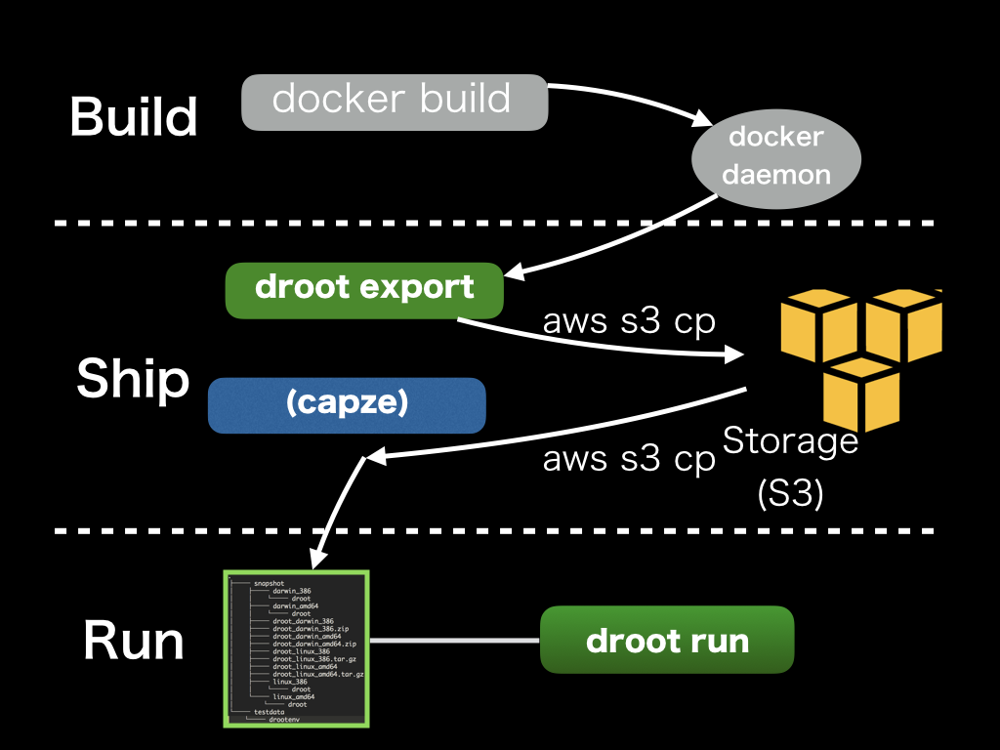

droot  [](https://github.com/yuuki/droot/releases) [](https://travis-ci.org/yuuki/droot) [](https://goreportcard.com/report/github.com/yuuki/droot) [](http://doge.mit-license.org)
=====

Droot is A simple chroot-based application container engine to build, ship, run with chroot instead of docker run. Droot aims to simply escape dependency hell.

## Overview

[Docker](https://www.docker.com) has a powerful concept about an application deployment process, that is Build, Ship, Run. But there are many cases that docker runtime is too complicated and beyond our current capabilities, especially on production.

Droot provides a simpler container runtime without annoying Linux Namespaces. Droot depends on traditional Linux functions such as chroot(2), Linux capabilities(7) and a bind mount. `droot` helps you to chroot a container image built by `docker` and to import/export container images on Amazon S3.

- Build: Build archives by `docker build` and `docker export`
- Ship: Upload the archives to a storage (like Amazon S3), and Download archives from it.
- Run: chroot(2), Linux capabilities(7), and a bind mount.



## Requirements

- Docker (`droot export` only depends on it)
- Linux (`droot run` and `droot umount` only supports it)

## Installation

### Homebrew
```bash
$ brew tap yuuki/droot
$ brew install droot
```

### Download binary from GitHub Releases
[Releases・yuuki/droot - GitHub](https://github.com/yuuki/droot/releases)

### Build from source
```bash
 $ go get github.com/yuuki/droot/cmd/droot
```

## Usage

```bash
$ docker build -t dockerfiles/app
$ droot export dockerfiles/app | gzip -cq | aws s3 cp - s3://drootexamples/app.tar.gz
```

```bash
$ mkdir -p /tmp/app /var/containers/app
$ aws s3 cp s3://drootexamples/app.tar.gz - | tar -xpfz - -C /tmp/app
$ mv -T /tmp/app /var/containers/app
$ sudo droot run --cp --user appuser --group appgroup --bind /var/log --root /var/containers/app -- command
```

```bash
$ sudo droot umount --root /var/containers/app
```

### Integration with capze

https://github.com/yuuki/capze

```bash
$ aws s3 cp s3://drootexamples/app.tar.gz - | tar xzf - -C /tmp/app
$ capze --keep 5 /tmp/app /var/containers/app
```

### How to set docker endpoint

Droot supports the environment variables same as docker-machine such as DOCKER_HOST, DOCKER_TLS_VERIFY, DOCKER_CERT_PATH.
ex.
```
DOCKER_TLS_VERIFY=1
DOCKER_HOST=tcp://192.168.x.x:2376
DOCKER_CERT_PATH=/home/yuuki/.docker/machine/machines/dev
```

## Development

Droot uses a package using cgo, so it is necessary to build in Linux for a Linux binary.
It is recommanded to use Docker for development if you are on OSX and other OSs.

### build in Docker container

```bash
$ ./script/build_in_container.sh make build
```

## Contribution

1. Fork ([https://github.com/yuuki/droot/fork](https://github.com/yuuki/droot/fork))
1. Create a feature branch
1. Commit your changes
1. Rebase your local changes against the master branch
1. Run test suite with the `make test` command and confirm that it passes
1. Create a new Pull Request

## Author

[y_uuki](https://github.com/yuuki)
